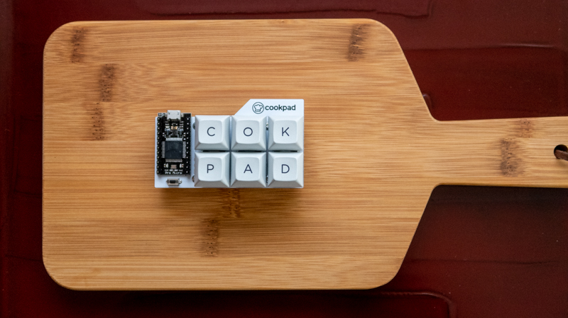

# Cookpad Pad

A six keys macro pad made by Cookpad.



## Firmware

Clone [QMK](https://github.com/takai/qmk_firmware/tree/cookpad-pad) repositories and setup build environment.
Then type following command:

```
$ make cookpad_pad:default:avrdude
```

## Build Guide

### Parts List

- 1 Cookpad Pad PCB
- 1 Acrylic switch plate
- 1 Acrylic bottom plate
- 1 Pro Micro
- 6 1N4148W diodes
- 6 Keyboard Swiches
- 1 Tact switch
- 4 M2 5mm spacer
- 8 M2 Screws
- 4 Rubber feet

### Build Steps

1. Solder components
      - Solder diodes
      - Solder Pro Micro
      - Solder push button
2. Fix spacers with screw
3. Solder swiches
      - Put switches into a plate
      - Solder switches
4. Fix a bottom plate with screws
