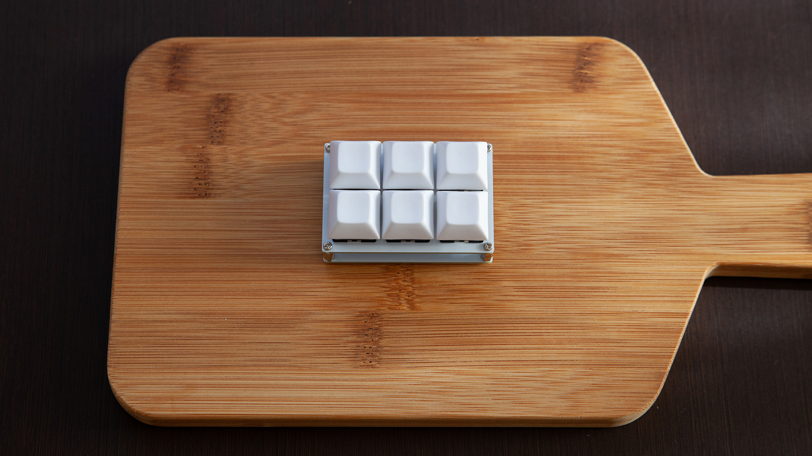

# Cookpad Pad 2

A six keys macro pad made by Cookpad.



## Firmware

Clone [forked QMK](https://github.com/takai/qmk_firmware/tree/cookpad-pad2) repositories and setup build environment.
Then type following command:

```
$ make cookpad_pad:default:dfu
```
